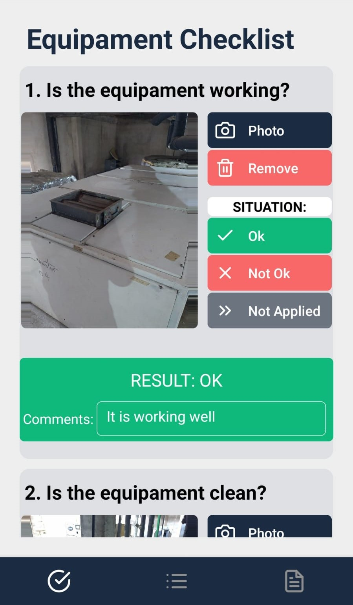
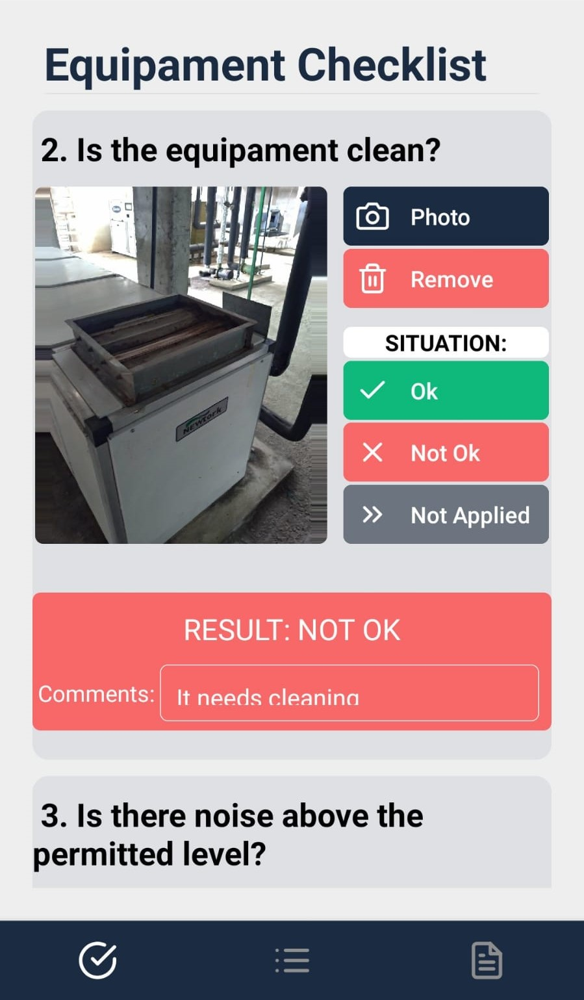
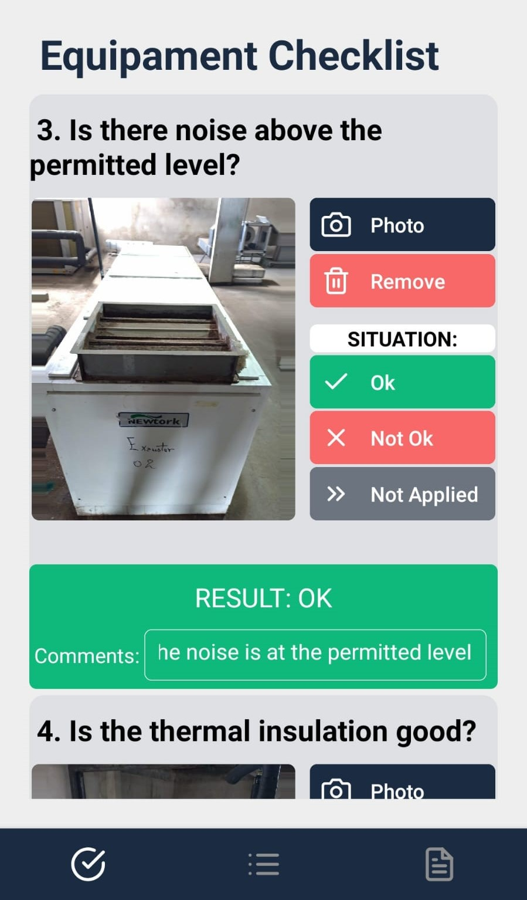
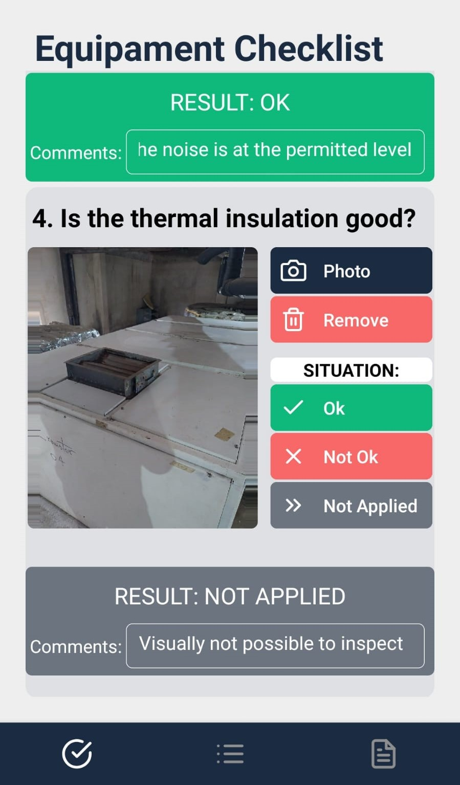
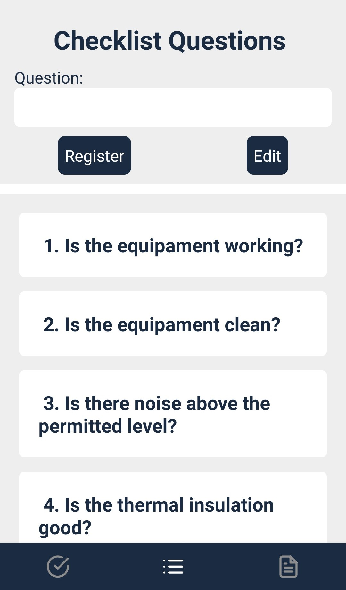
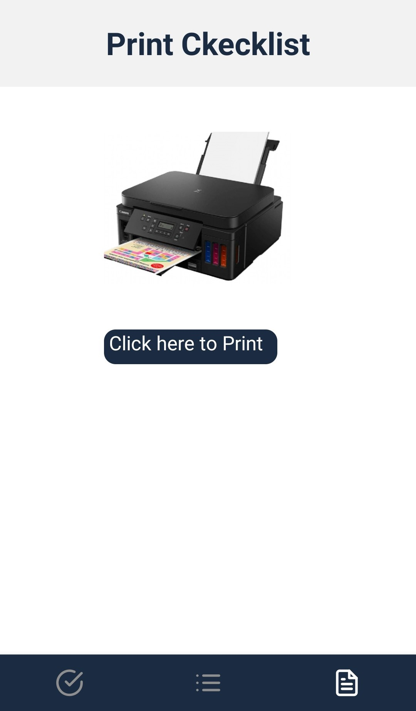
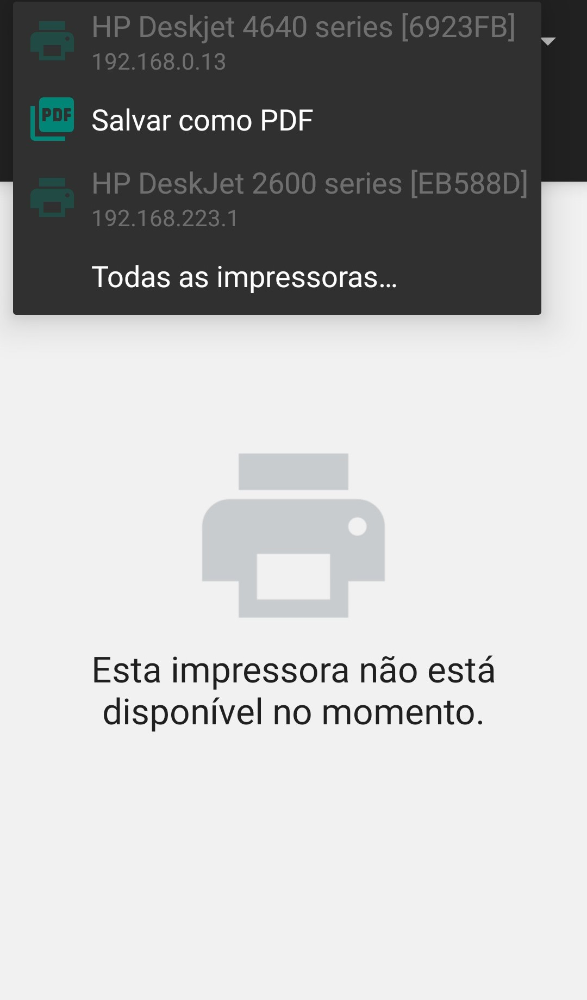
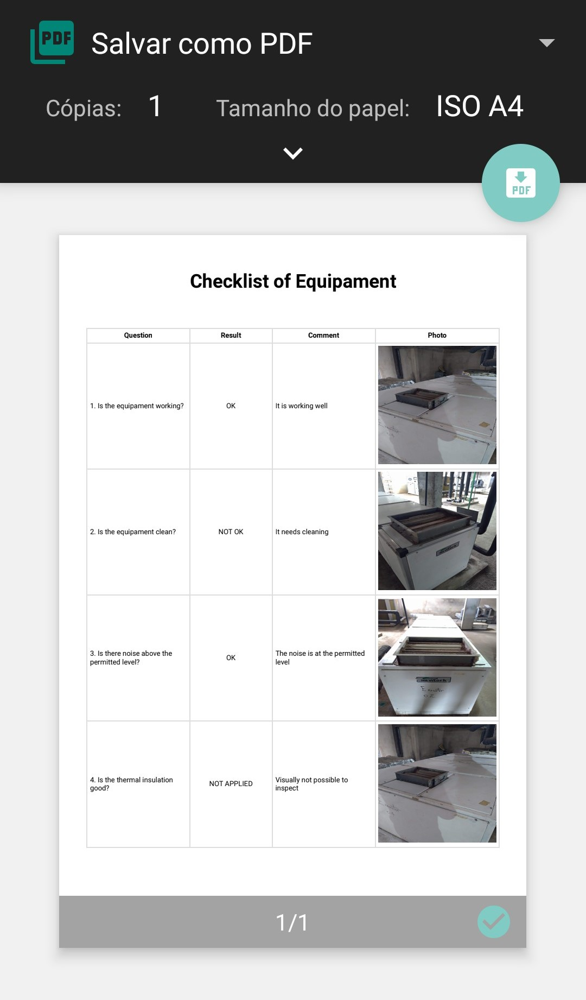
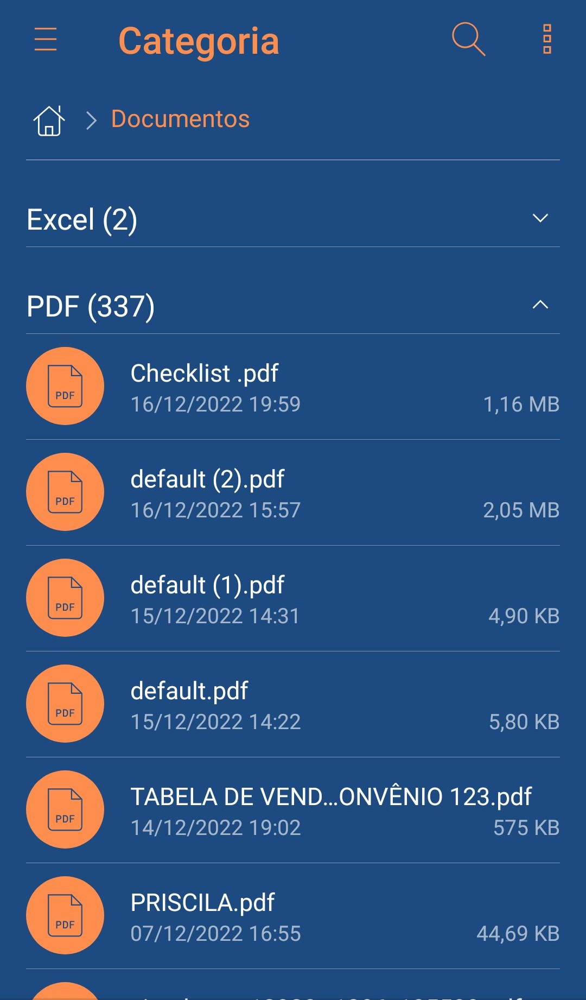
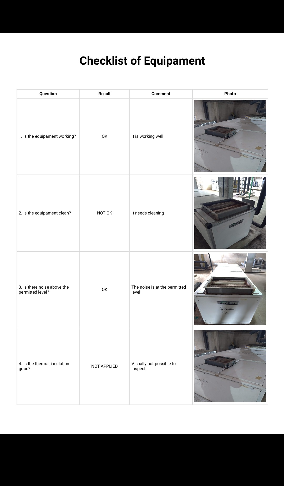

# project-equipament-checklist

# version 1.0

## Functionalities:
 - App to make a checklist of any equipment, machine, etc.
 - It has a screen just for registering the checklist questions. On this screen you can register, edit and delete questions from the checklist
 - For the user to edit, with a simple click on the question, the app selects the question and the user can already change it. To change, click on the edit button.
 - For the user to delete a question, the question must be held for a long time. After this, the question is removed from the checklist
 - On the checklist screen, he can take a picture or he can grab it from the mobile phone album for that checklist question
 - The user then chooses the status for the checklist item, be it 'ok', 'not ok' or 'not applied. The item changes the color according with choose
 - The user can also make some comments to make the inspection more detailed
 - In the last tab of app options, we have the option to print, that when clicked gives the option to print to printer or print to pdf. Before doing so, a preview of how the file will look printed appears
 - And not to lose the cheklist done, everything is being saved in the database, which brings security and convenience. When the app starts, it already brings the last images, questions, comments and results marked on the checklist

## Using:
- React Native CLI
- Camera to take a Picture
- Library to Acess images of Mobile Library
- Database (Firebase) to save and load the checklist
- Library for printing on both printer and pdf 
- This library above (PDF) does not allow image, we had to put another library that transforms the image in base64 to be able to allow image printing
- Conditional Format in Components according with situation of equipament checklist
- Bottom Tabs from the React Navigation library to switch between pages
- Vector Icons Library to some icons 
- Scroll View
- Styled Components

 

# version 2.0

### Main changes:
- Database Change: Changed from external Firebase to Asyncstorage, internal to mobile. Makes more sense for the type of work that will be done by the person using the checklist
- The photos inverted 90º:  The photos taken by the camera were coming out inverted in 90º when put to print. This was fixed.

 

## Images:

### Checklist Screen

 

---------------------------------------------------------------------------------------
### Checklist Screen

 

---------------------------------------------------------------------------------------
### Checklist Screen

 

---------------------------------------------------------------------------------------
### Checklist Screen

 

---------------------------------------------------------------------------------------
### Checklist Questions Screen

 

---------------------------------------------------------------------------------------
### Printer Screen

 

---------------------------------------------------------------------------------------
### Printer Screen

 

---------------------------------------------------------------------------------------
### Printer Screen

 

---------------------------------------------------------------------------------------
### Pdf File in Mobile

 

---------------------------------------------------------------------------------------
### Pdf opened

 

